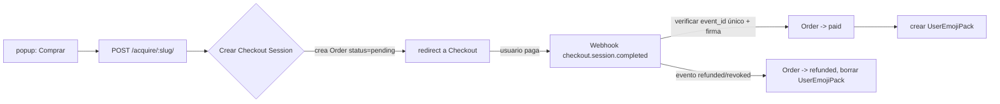

# Pagos de packs premium — design doc (issue #5)

> Estado: **decisión pendiente** — este doc plantea las opciones, no implementa nada.
> Issue de origen: `AcquirePackView no implementa pagos` (#5).

## Contexto / estado actual

- `emojis/views.py:AcquirePackView` hace `get_or_create` de `UserEmojiPack` y responde `400`
  para packs gratis y packs ya adquiridos. **No media ningún pago**: cualquier usuario
  autenticado adquiere un pack "premium" gratis.
- Modelos: `EmojiPack` (con `is_free` y `price`) y `UserEmojiPack` (relación usuario↔pack).
- Frontend: `popup.js` llama `api.acquirePack(slug)` (POST
  `/api/emojis/store/{slug}/acquire/`). No hay webhook ni pasarela.

## Qué hay que decidir

| # | Decisión | Opciones | Mi recomendación |
|---|----------|----------|------------------|
| D1 | **Procesador / billing** | a) Stripe Checkout · b) Paddle / Lemon Squeezy (MoR) · c) PayPal | **b) MoR** para proyecto hobby: se ocupan IVA/impuestos/chargebacks y se factura desde el proveedor (merchant of record), menos carga legal. Stripe si quieres el control/API más simple. |
| D2 | **Modelo de venta** | a) Compra única permanente · b) Suscripción · c) Compra con expiración (renta) | **a) Compra única permanente** para el MVP: `UserEmojiPack` ya encaja tal cual. |
| D3 | **Entrega** | Webhook del proveedor que acredita `UserEmojiPack` · consulta sincrónica de estado | **Webhook** (fuente de verdad del pago), con reintentos y `idempotencia` por `event_id`. |
| D4 | **Reembolsos / revocación** | a) Refund revoca el pack (webhook `refunded`) · b) Mantener el pack tras refund | **a) revoca**: el estado "paid" es un derecho, no una preferencia. |
| D5 | **Precios** | Precio fijo por pack (`price`) vs precio desde la pasarela | Precio desde la pasarela (producto+priceId en la pasarela) para no duplicar lógica de moneda. |

## Flujo propuesto (asumiendo Stripe-ish / MoR, D1b–D4a)

Detalles clave:

- **Moda**: `Order` con `status` (`pending|paid|refunded|revoked`), `user`, `pack`,
  `amount`, `checkout_session_id`, `provider_event_id` (único) y `provider` (para soportar
  más de una pasarela después).
- **Idempotencia**: el webhook guarda `provider_event_id` en la Order; procesar dos veces el
  mismo evento es no-op. Reintentos del proveedor no duplican packs.
- **Firma**: validar la firma firmada del webhook (secreto en el entorno), nunca confiar en
  el cuerpo crudo.
- **Alcance mínimo** para el primer corte:
  1. `Order` + migración.
  2. `POST /acquire/:slug/` → crea Checkout Session (con `priceId` del pack) y devuelve URL.
  3. Webhook `completed` → marca paid + crea `UserEmojiPack`.
  4. Popup: botón comprar → abre checkout en pestaña nueva → al volver, refresca "Mis packs".
  5. Webhook `refunded` → revoca.

## Fuera de alcance de este corte (opciones futuras)

- Suscripción recurrente (D2b), packs con vencimiento (D2c), reels/tienda múltiple, cupones.

## Preguntas abiertas

- ¿Procesador? Si eliges MoR (Paddle/Lemon Squeezy), revisar sus fees e IVA; si Stripe, la
  cuenta/pais y los impuestos quedan de tu lado.
- ¿Moneda? (dólares para la pasarela, precio display en el popup).
- ¿Necesitas que `AcquirePackView` actual (sin pago) quede **fail-closed** mientras tanto, o
  lo dejamos como está hasta implementar el flujo real?